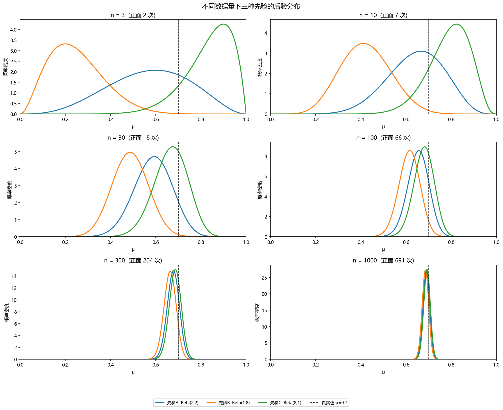
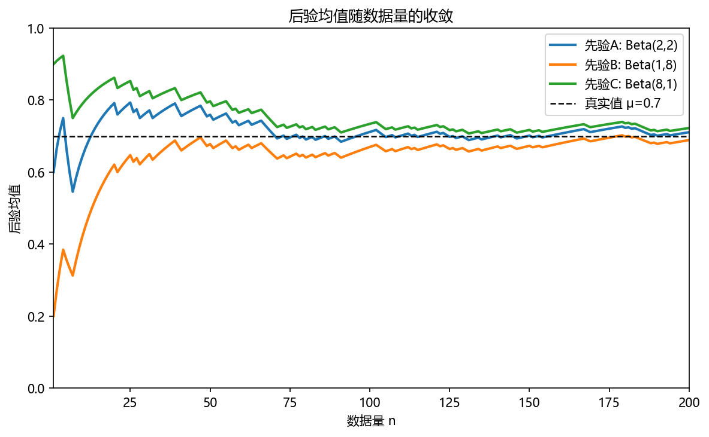
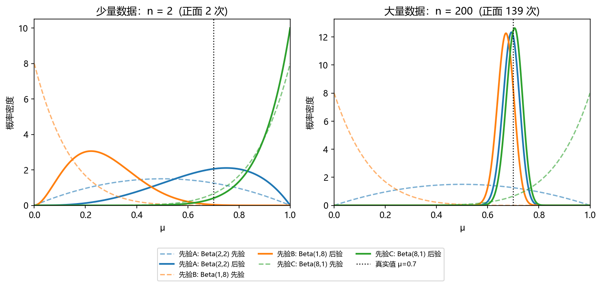
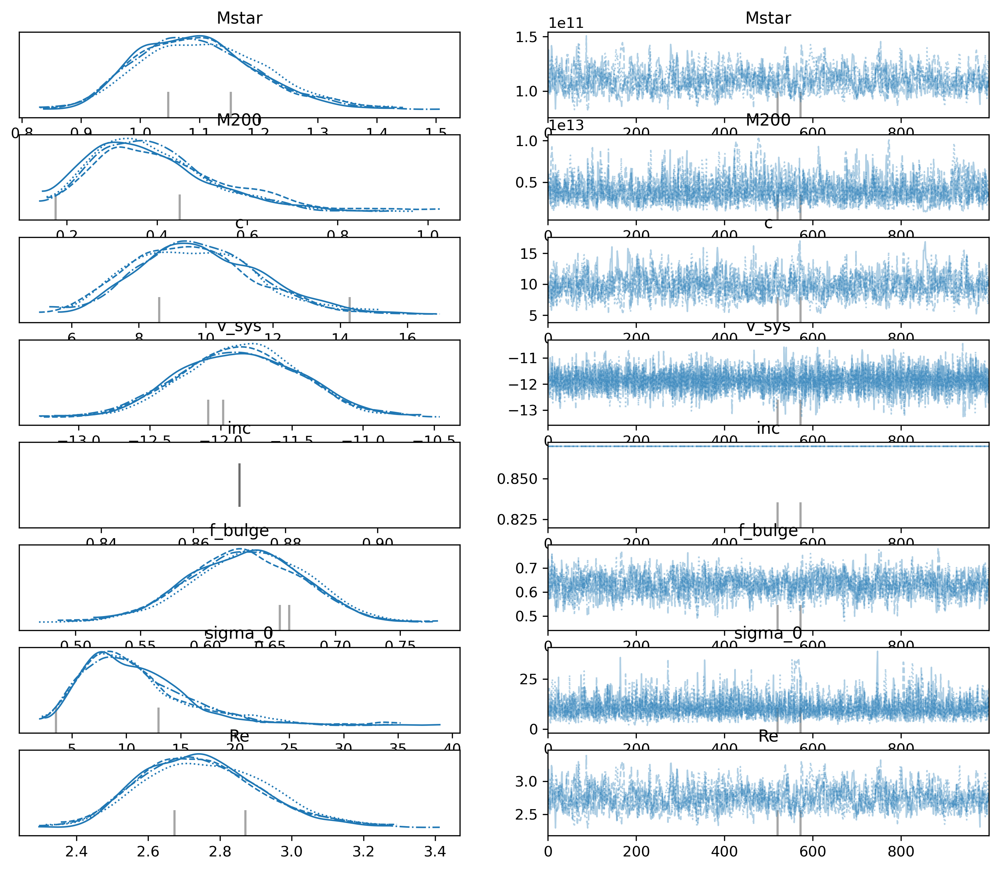
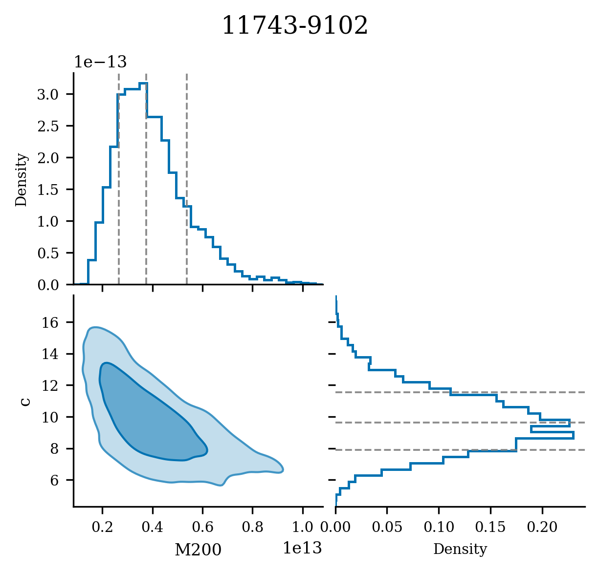
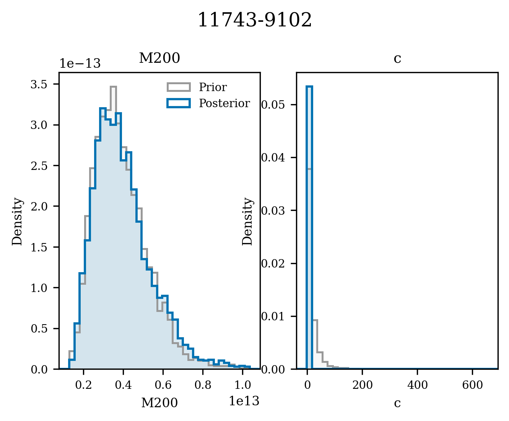

# How and Why to Use MCMC: A Practical Guide to Bayesian Inference

This guide introduces the Bayesian and MCMC concepts used by `manga-dm`, then connects them to the MaNGA NFW halo inference workflow. It is written for readers who want enough background to understand why the pipeline uses posterior samples rather than only point estimates.

---

## 1. Why Do We Need MCMC?

In scientific data analysis, we often need to answer questions like:

> "Given observational data $D$, what are the most likely model parameters $\theta$, and how uncertain are they?"

This is precisely what **Bayesian inference** aims to solve, and the answer is the **posterior distribution** $p(\theta|D)$.

However, computing the posterior directly is usually impossible, because of the normalization constant:

$$Z = p(D) = \int p(D|\theta)\,p(\theta)\,d\theta$$

This integral cannot be solved analytically in high-dimensional parameter spaces, nor can it be computed with ordinary numerical grids (the curse of dimensionality).

**MCMC (Markov Chain Monte Carlo)** takes a different approach:
Instead of computing the analytic form of $p(\theta|D)$, it **directly samples** from it — given enough samples, we can estimate any statistic (mean, variance, credible intervals, etc.).

---

## 2. Theoretical Foundations

### 2.1 Bayes' Theorem

#### Derivation

Bayes' theorem follows from the most basic **multiplication rule** of probability theory (the definition of conditional probability).

For any two events $A$ and $B$, the joint probability can be decomposed in two ways:

$$p(A, B) = p(A|B)\,p(B) = p(B|A)\,p(A)$$

Substituting $A = \theta$ (parameters) and $B = D$ (data):

$$p(\theta, D) = p(\theta|D)\,p(D) = p(D|\theta)\,p(\theta)$$

Dividing both sides by $p(D)$ gives **Bayes' theorem**:

$$\boxed{p(\theta|D) = \frac{p(D|\theta)\,p(\theta)}{p(D)}}$$

where the denominator $p(D)$ marginalizes over all parameters, ensuring the posterior is a normalized probability distribution:

$$p(D) = \int p(D|\theta)\,p(\theta)\,d\theta \equiv Z$$

#### Meaning of Each Term

$$\boxed{p(\theta|D) = \frac{p(D|\theta)\,p(\theta)}{Z}}$$

| Symbol | Name | Meaning |
|---|---|---|
| $p(\theta\|D)$ | **posterior** | Probability distribution of parameters after seeing the data |
| $p(D\|\theta)$ | **likelihood** | Probability of the data given the parameters |
| $p(\theta)$ | **prior** | Our belief about the parameters before seeing the data |
| $p(D) = Z$ | **evidence** | Normalization constant, typically difficult to compute |

Key insight: although $Z$ is difficult to compute, we can evaluate the **unnormalized posterior** point by point:

$$f(\theta) = p(D|\theta)\cdot p(\theta)$$

Since $p(\theta|D) = f(\theta)/Z$, the ratio between two points cancels $Z$:

$$\frac{p(\theta'|D)}{p(\theta|D)} = \frac{f(\theta')/Z}{f(\theta)/Z} = \frac{f(\theta')}{f(\theta)}$$

**Why compute "the ratio of two points"?**

$Z$ is a global constant that integrates over all parameters — computing it alone requires traversing the entire parameter space at great cost. But when we calculate the **ratio** of posterior probabilities at two parameter points $\theta$ and $\theta'$, $Z$ appears in both numerator and denominator and cancels out.

This means: we only need to be able to compute $f(\theta) = p(D|\theta)\cdot p(\theta)$ (prior times likelihood, which is usually easy) at any given point, and we can determine whether $\theta'$ is "more likely" or "less likely" than $\theta$ — without ever knowing the numerical value of $Z$.

MCMC exploits exactly this ratio to decide whether to accept a candidate point (see Section 2.4 below), thereby sampling from the correct posterior distribution without ever computing $Z$.

---

### 2.2 Monte Carlo Integration

#### Basic Idea

If $\theta_1, \theta_2, \ldots, \theta_K$ are independent samples drawn from a distribution $p(\theta)$, then the expectation of any function can be approximated as:

$$E_{p(\theta)}[g(\theta)] = \int g(\theta)\,p(\theta)\,d\theta \approx \frac{1}{K}\sum_{k=1}^{K}g(\theta_k)$$

As $K \to \infty$, this approximation is guaranteed to converge by the **law of large numbers**.

#### When the Normalization Constant Is Unknown

In practice we only have the unnormalized $f(\theta)$, giving:

$$E_{p(\theta)}[g(\theta)] = \frac{\int g(\theta)\,f(\theta)\,d\theta}{\int f(\theta)\,d\theta} \approx \frac{1}{K}\sum_{k=1}^{K}g(\theta_k)$$

As long as the samples $\{\theta_k\}$ come from the correct distribution (even if $Z$ is unknown), the approximation still holds.

---

### 2.3 Markov Chains

A **Markov chain** is a stochastic process where the next state $\theta^{(t+1)}$ depends only on the current state $\theta^{(t)}$, not on the history:

$$p(\theta^{(t+1)} | \theta^{(t)}, \theta^{(t-1)}, \ldots) = p(\theta^{(t+1)} | \theta^{(t)})$$

The core idea of MCMC: **construct a Markov chain whose stationary distribution is exactly the target posterior $p(\theta|D)$**.

After running the chain long enough, the sequence of states is a set of (correlated) samples from $p(\theta|D)$.

---

### 2.4 The Metropolis-Hastings Algorithm

The Metropolis-Hastings (MH) algorithm is the most fundamental MCMC method. Understanding it is essential for mastering all MCMC approaches.

#### Algorithm Steps

Given current state $\theta^{(t)}$:

1. **Propose**: Draw a candidate $\theta'$ from a proposal distribution $q(\theta' | \theta^{(t)})$ (e.g., a normal distribution centered at the current point)

2. **Compute acceptance ratio**:

$$\alpha = \min\left(1,\ \frac{f(\theta')\,q(\theta^{(t)}|\theta')}{f(\theta^{(t)})\,q(\theta'|\theta^{(t)})}\right)$$

3. **Accept or reject**:
   - With probability $\alpha$, accept: set $\theta^{(t+1)} = \theta'$
   - With probability $1-\alpha$, reject: set $\theta^{(t+1)} = \theta^{(t)}$

4. Repeat until enough samples are collected.

**Intuition**: If the candidate point has higher posterior probability, always accept it; if lower, there is still a chance of acceptance (to avoid getting stuck in local optima). When the proposal distribution is symmetric ($q(\theta'|\theta) = q(\theta|\theta')$), the acceptance ratio simplifies to:

$$\alpha = \min\left(1,\ \frac{f(\theta')}{f(\theta^{(t)})}\right)$$

---

## 3. Influence of Priors and Data on the Posterior

### 3.1 Core Phenomenon

The Bayesian update formula can be written more intuitively as:

$$\underbrace{p(\theta|D)}_{\text{posterior}} \propto \underbrace{p(D|\theta)}_{\text{likelihood (the voice of data)}} \times \underbrace{p(\theta)}_{\text{prior (existing beliefs)}}$$

The posterior is a "compromise" between likelihood and prior. When the two "compete" for control of the posterior, the **sample size** determines which dominates:

| Sample Size | Posterior primarily determined by | Difference across priors |
|---|---|---|
| Very small ($n \sim 1$–$5$) | **Prior** | Significant differences |
| Moderate ($n \sim 10$–$50$) | Prior and data jointly | Differences noticeably shrink |
| Large ($n \gg 100$) | **Data (likelihood)** | Differences nearly vanish |

> **Intuition**: $n$ data points constrain parameters like "$n$ votes," while the prior is like "an initial vote with a few ballots." The more data you have, the less the prior's initial votes matter.

---

### 3.2 Concrete Example: Estimating a Coin's Bias

**Problem**: We have a coin whose true heads probability is $\mu = 0.7$. After flipping it some number of times, we use Bayesian methods to estimate $\mu$.

**Model**:

$$p(\text{heads}|\mu) = \mu, \quad p(\mu) = \text{Beta}(\alpha_0, \beta_0)$$

> **Beta distribution and conjugate prior**: The Beta distribution $\text{Beta}(\alpha, \beta)$ is defined on $[0, 1]$, with shape controlled by two positive real parameters $\alpha$ (equivalent to "prior heads count") and $\beta$ ("prior tails count"); its mean is $\alpha/(\alpha+\beta)$. If the prior is a Beta distribution and the likelihood is binomial, the posterior is also a Beta distribution — this property, where "the prior family and likelihood family remain in the same distribution family after updating," is called **conjugacy**. Conjugate priors give closed-form analytical posteriors without requiring MCMC sampling, making them ideal pedagogical examples for studying prior influence.

The Beta distribution is conjugate to the binomial likelihood, so the posterior remains a Beta distribution:

$$p(\mu | n, h) = \text{Beta}(\alpha_0 + h,\ \beta_0 + (n-h))$$

where $h$ is the number of heads and $n$ is the total number of flips. The posterior mean is:

$$\bar{\mu}_{\text{post}} = \frac{\alpha_0 + h}{\alpha_0 + \beta_0 + n}$$

As $n \to \infty$, $\bar{\mu}_{\text{post}} \to h/n \to \mu_{\text{true}}$, so **the influence of the prior is overwhelmed by the data**.

**Using three different priors**:

- **Prior A**: $\text{Beta}(2, 2)$ — weak prior, neutral, mean = 0.5
- **Prior B**: $\text{Beta}(1, 8)$ — strong wrong prior, biased low, mean ≈ 0.11
- **Prior C**: $\text{Beta}(8, 1)$ — strong wrong prior, biased high, mean ≈ 0.89

---

### 3.3 Visualization: Evolution of the Posterior with Sample Size

The figure below shows the posterior distributions under the three priors at different sample sizes ($n = 3, 10, 30, 300$):



*Figure 1: Posterior distributions under three priors (weak prior A, strongly biased-low prior B, strongly biased-high prior C) at different sample sizes. As sample size increases, prior differences are progressively overwhelmed by the data.*

**Observations**:
- **$n = 3$**: The three posterior curves have distinctly different shapes and peak locations — the posterior essentially mirrors the prior shape.
- **$n = 10$**: Differences begin to shrink, but the wrong priors (especially prior B) still pull the posterior significantly away from the true value.
- **$n = 30$**: All three curves begin to converge toward $\mu = 0.7$, with peak positions becoming similar.
- **$n = 300$**: The three curves nearly overlap; the choice of prior has almost no effect on the final conclusion.

---

### 3.4 Convergence Trajectory of the Posterior Mean

The following figure tracks how the posterior mean for each of the three priors gradually converges to the true value as the sample size increases from 1 to 200:



*Figure 2: Trajectory of the posterior mean under three priors as the number of coin flips $n$ increases. After roughly $n = 50$, the three curves become indistinguishable, all converging toward the true value $\mu = 0.7$.*

**Observations**:
- Initially, the three lines differ dramatically (determined by their prior means).
- As $n$ grows, all three lines converge toward $\mu = 0.7$.
- After roughly $n = 50$, the three lines become nearly indistinguishable.

---

### 3.5 Small Data vs. Large Data: An Intuitive Comparison



*Figure 3: Comparison of priors (dashed lines) and posteriors (solid lines) for small ($n = 2$, left panel) and large ($n = 200$, right panel) sample sizes. With sufficient data, the posterior is highly robust to the choice of prior.*

**Dashed lines** are priors, **solid lines** are posteriors.

- **Left panel ($n = 2$)**: The posterior is barely more than a slight adjustment of the prior; three different priors produce three completely different posteriors.
- **Right panel ($n = 200$)**: Regardless of how different the priors are, the posterior is sharply concentrated around the true value, with the three solid lines nearly overlapping.

---

### 3.6 Practical Implications

This phenomenon yields two important practical guidelines:

**1. When data are scarce, the choice of prior is critical.**
If data are sparse, a strong but incorrect prior can severely distort conclusions. In such cases, use a **weakly informative prior**: encode only reasonable order-of-magnitude constraints without imposing a specific shape.

**2. When data are abundant, the prior has negligible impact, but still serves a purpose.**
With large amounts of data, reasonable priors and weak priors give nearly identical posteriors — the analysis is **robust** to prior choice. However, the prior still helps:
- Regularization, preventing parameters from diverging (equivalent to L2 regularization)
- Guiding the MCMC sampler to explore parameter space more efficiently

> **In short**: The prior encodes "your belief when you have no data." The more data you have, the less this belief affects the conclusions — eventually, the data speak for themselves.

---

## 4. MCMC in Practice

### 4.1 NUTS and PyMC

#### NUTS (No-U-Turn Sampler)

The MH algorithm is inefficient in high-dimensional spaces. Modern MCMC software commonly uses gradient-based methods:

- **HMC (Hamiltonian Monte Carlo)**: Uses gradient information to simulate "physical trajectories" through parameter space, exploring distant regions in a single step.
- **NUTS**: An adaptive version of HMC that automatically adjusts the number of steps, and is currently the most widely used high-dimensional MCMC method.

> **Physical intuition of HMC**: HMC imagines parameter space as a terrain where $-\log p(\theta|D)$ is the potential energy (valleys = high-probability regions). Sampling introduces an auxiliary "momentum" variable, gives each candidate a random initial velocity, then "rolls a ball" along the gradient direction according to Hamiltonian mechanics for a certain number of steps, finally accepting or rejecting the landing point with an MH step. This allows each step to jump to a distant region rather than taking small steps near high-probability areas like random-walk MH, vastly improving exploration efficiency in high dimensions. NUTS builds on this by automatically determining "when to stop rolling" (i.e., when the trajectory would turn back toward higher potential energy), eliminating the need to manually tune the number of integration steps.

NUTS requires computing the gradient of $\log f(\theta)$ with respect to $\theta$, so the parameter space must be continuous.

#### Bayesian Inference with PyMC

```python
import pymc as pm
import numpy as np

# Simulate data: y = a*x + b + noise
x = np.linspace(0, 10, 50)
y_obs = 2.5 * x + 1.0 + np.random.normal(0, 1, 50)

with pm.Model() as model:
    # Priors
    a = pm.Normal('a', mu=0, sigma=10)
    b = pm.Normal('b', mu=0, sigma=10)
    sigma = pm.HalfNormal('sigma', sigma=1)

    # Likelihood
    mu = a * x + b
    y = pm.Normal('y', mu=mu, sigma=sigma, observed=y_obs)

    # Sampling (defaults to NUTS)
    trace = pm.sample(1000, tune=500, chains=4, return_inferencedata=True)

# Examine results
import arviz as az
az.summary(trace, var_names=['a', 'b', 'sigma'])
```

---

### 4.2 Practical Guidelines

#### Burn-in

The initial portion of a chain has not yet reached the stationary distribution. These samples are called **burn-in** and must be discarded (referred to as `tune` in PyMC).

#### Convergence Diagnostics

| Diagnostic | Meaning | Ideal Value |
|---|---|---|
| $\hat{R}$ (R-hat) | Ratio of between-chain variance to within-chain variance | $\hat{R} < 1.01$ |
| ESS (Effective Sample Size) | Number of equivalent independent samples after removing autocorrelation | $\text{ESS} > 400$ |
| Trace plot | Trajectory of the chain; should look like a "fuzzy caterpillar" with good mixing | — |

#### Choosing Priors

- **Weakly informative prior**: Provides reasonable magnitude constraints without over-limiting parameters. This is the recommended practice.
- **Overly diffuse priors**: Can cause low sampling efficiency or even non-convergence.
- **Overly strong priors**: Can suppress the information from the data.

#### Common Issues

| Symptom | Possible Cause | Solution |
|---|---|---|
| $\hat{R} \gg 1$ | Chain not converged, strong parameter correlations | Increase tune steps, reparameterize |
| Low ESS | Severe sampling autocorrelation | Increase draws, check priors |
| Divergences | Rapid changes in posterior curvature | Increase `target_accept` (e.g., to 0.95) |

---

### 4.3 Workflow Summary

```
Define model (priors + likelihood)
            ↓
Run MCMC sampler (e.g., NUTS)
            ↓
Check convergence (R-hat, ESS, trace plot)
            ↓
Extract results from posterior samples
(mean, median, credible intervals, etc.)
```

**One-sentence summary**: MCMC constructs a Markov chain that converges to the target posterior distribution, transforming an intractable integration problem into a manageable sampling problem.

---

## 5. Astrophysical Example: MaNGA Galaxy Dark Matter Halo Parameter Inference

> This chapter uses the current NFW model implementation, `src.models.dm_nfw.DmNfw`, as an example of MCMC in an astrophysical workflow.

### 5.1 Problem Background

**MaNGA** (Mapping Nearby Galaxies at Apache Point Observatory) is a core survey of SDSS-IV, using **Integral Field Unit (IFU) spectroscopy** to provide two-dimensional Hα velocity fields for approximately 10,000 nearby galaxies.

> **IFU spectroscopy and spaxels**: Traditional spectrographs collect light from a single point or a narrow slit. An IFU divides the telescope focal plane into an array of spatially distributed apertures (MaNGA uses a hexagonal fiber bundle), simultaneously obtaining spectra from hundreds of spatial positions. Each spatial pixel unit is called a **spaxel** (spatial pixel). MaNGA fits the Hα emission line line-of-sight velocity for each spaxel, and the DAP (Data Analysis Pipeline) outputs the two-dimensional velocity field map, which is the raw input for rotation curve extraction.

The core problem: from the two-dimensional observed velocity field, perform Bayesian inference on the structural parameters of the galaxy's dark matter halo:

- $M_{200}$: The virial mass of the dark matter halo (defined as the total mass enclosed within the radius where the mean density is 200 times the cosmological critical density)
- $c = R_{200}/r_s$: The concentration parameter (describing how concentrated the dark matter is in space)

These two parameters describe the **NFW** (Navarro-Frenk-White) density profile, a core prediction of the $\Lambda$CDM cosmological model for galactic-scale structure.

> **NFW profile**: Navarro, Frenk, and White (1997) showed that the density distribution of dark matter halos as a function of radius can be described by a nearly universal form: $\rho(r) \propto (r/r_s)^{-1}(1+r/r_s)^{-2}$, with an inner $r^{-1}$ cusp and an outer $r^{-3}$ decline. $r_s$ is the scale radius, the concentration $c \equiv R_{200}/r_s$ describes where the transition between inner and outer profiles occurs, and $M_{200}$ gives the total halo mass. This profile is widely used in dark matter studies from galactic to cluster scales.

Constraining these two parameters directly from observational data requires Bayesian inference to handle the strong parameter degeneracy and non-Gaussian posterior.

---

### 5.2 Physical Model

The rotation curve describes the radial distribution of the circular orbital velocity $V_{\rm rot}(r)$ of gas in a disk galaxy. The force balance equation decomposes the rotation velocity into three components:

$$\boxed{V_{\rm rot}^2(r) = V_{\star}^2(r) + V_{\rm dm}^2(r) - V_{\rm drift}^2(r)}$$

**Stellar component** (bulge + disk):

$$V_{\star}^2(r) = V_{\rm bulge}^2(r) + V_{\rm disk}^2(r)$$

$$V_{\rm bulge}^2(r) = \frac{G M_{\rm bulge}\, r}{(r + a)^2}, \qquad M_{\rm bulge} = f_{\rm bulge} M_\star,\quad a = \frac{R_e}{1.8153}$$

$$V_{\rm disk}^2(r) = \frac{2 G M_{\rm disk}}{R_d}\, y^2\bigl[I_0(y)K_0(y) - I_1(y)K_1(y)\bigr], \qquad y = \frac{r}{2R_d},\quad R_d = \frac{R_e}{1.678}$$

where $I_n, K_n$ are modified Bessel functions and $f_{\rm bulge}$ is the bulge mass fraction.

**NFW dark matter halo component**:

$$V_{\rm dm}^2(r) = \frac{V_{200}^2}{x} \cdot \frac{\ln(1 + cx) - \dfrac{cx}{1+cx}}{\ln(1+c) - \dfrac{c}{1+c}}, \qquad x \equiv \frac{r}{R_{200}}$$

$$V_{200} = \bigl(10\, G\, H(z)\, M_{200}\bigr)^{1/3}, \qquad H(z) = H_0\sqrt{\Omega_m(1+z)^3 + \Omega_\Lambda}$$

**Asymmetric drift correction** (pressure support from gas turbulence causes the rotation velocity to be underestimated):

$$V_{\rm drift}^2(r) = 2\sigma_0^2 \cdot \frac{r}{R_d}$$

**Projection model** (from intrinsic rotation velocity to observed line-of-sight velocity):

$$V_{\rm obs}(r, \phi) = V_{\rm sys} + V_{\rm rot}(r) \cdot \sin i \cdot \cos\phi$$

---

### 5.3 Parameters and Priors

The parameter vector is $\boldsymbol{\Theta} = \{M_\star,\, M_{200},\, c,\, \sigma_0,\, V_{\rm sys},\, R_e,\, f_{\rm bulge},\, \sigma_{\rm int},\, \nu\}$, totaling 9 free parameters.

The core goal of prior design: **use photometric constraints (NSA data) to stabilize the $M_{200}$–$c$ degeneracy, while not injecting a population-level $c$–$M_{200}$ slope into individual galaxy fits.**

> **NSA (NASA-Sloan Atlas)**: A galaxy catalog based on reprocessed SDSS imaging, providing morphological parameters (Sérsic index $n$, effective radius $R_e$, ellipticity $b/a$) and stellar masses. All MaNGA target galaxies have corresponding NSA entries, whose photometric parameters serve as prior central values.

| Parameter | Prior Distribution | Physical Justification |
|---|---|---|
| $\log_{10}M_\star$ | $\mathcal{N}(\log_{10}M_{\star,\rm NSA},\;0.05\,\rm dex)$ | Anchored to NSA photometric stellar mass |
| $\log_{10}M_{200}$ | $\mathcal{TN}(\mu_{\rm SHMR},\;0.15\,\rm dex;\;\pm3\sigma)$ | Estimated from $M_\star$ via Moster et al. (2013) SHMR |
| $\log_{10}c$ | $\mathcal{N}(\log_{10}9.0,\;0.50\,\rm dex)$ | Typical concentration; **decoupled from $M_{200}$**, no slope imposed |
| $\log_{10}\sigma_0$ | ${\rm LogN}(\log 10\,\rm km/s,\;0.20\,\rm dex)$ | Order-of-magnitude constraint on gas pressure support |
| $V_{\rm sys}$ | $\mathcal{TN}(V_{\rm sys,NSA},\;5\,\rm km/s;\;\pm20\,\rm km/s)$ | Anchored to NSA redshift |
| $\log_{10}R_e$ | ${\rm LogN}(R_{e,\rm NSA},\;0.05\,\rm dex)$ | Photometric effective radius (NSA) |
| ${\rm logit}(f_{\rm bulge})$ | $\mathcal{N}(1.2(n-2.5),\;0.2)$ | Bulge fraction estimated from Sérsic index $n$ |
| $\sigma_{\rm int}$ | ${\rm Exp}(2\bar{\sigma}_{\rm meas})$ | Intrinsic scatter of residuals beyond the model |
| $\nu - 2$ | $\Gamma(2.0,\;0.1)$ | Student-$t$ tail weight, suppresses outliers |

> **SHMR (Stellar-to-Halo Mass Relation)**: There is a statistical relationship between a galaxy's stellar mass $M_\star$ and its host dark matter halo's virial mass $M_{200}$, which can be calibrated from the observed galaxy stellar mass function using abundance matching. Moster et al. (2013) provided a parametric form $M_\star/M_{200} = 2N[(M_{200}/M_1)^{-\beta} + (M_{200}/M_1)^{\gamma}]^{-1}$, with peak efficiency near $M_{200} \approx 10^{12}\,M_\odot$. The SHMR scatter is about 0.15–0.20 dex, which informs the choice of $M_{200}$ prior width.

> **Sérsic index and logit transform**: The Sérsic index $n$ describes how concentrated a galaxy's light profile is ($n = 1$ for an exponential disk, $n = 4$ for a de Vaucouleurs bulge). The bulge mass fraction $f_{\rm bulge} \in (0,1)$ is logit-transformed as $\mathrm{logit}(f) = \ln(f/(1-f))$ to map it to the full real line, then given a normal prior — this prevents the sampler from behaving poorly near boundaries. The prior center $1.2(n-2.5)$ exploits the empirical correlation where disk-dominated systems ($n < 2.5$, $f_{\rm bulge}$ smaller) and bulge-dominated systems ($n > 2.5$, $f_{\rm bulge}$ larger) follow this trend.

This exemplifies the prior design principles discussed in Chapter 3: the $M_{200}$ prior width of 0.15 dex is narrow enough to stabilize the degeneracy, yet wide enough (≈ 40% fractional error) to let the data correct any SHMR bias; the $c$ prior width of 0.50 dex is much wider than that of $M_{200}$, so the posterior is primarily constrained by the rotation curve shape rather than the prior.

---

### 5.4 Likelihood Function

The error budget of the observed velocity field has two components: measurement errors (from the DAP inverse variance map) and model residuals (beam smearing, non-axisymmetric structure, etc.). A Student-$t$ likelihood is used to suppress the influence of outliers:

$$V_{\rm obs} \sim {\rm StudentT}\!\left(\nu,\ \mu = V_{\rm obs,model},\ \sigma = \sqrt{\sigma_{\rm meas}^2 + \sigma_{\rm int}^2}\right)$$

where $\sigma_{\rm meas} = 1/\sqrt{\rm IVAR}$ comes from the DAP error map, $\sigma_{\rm int}$ accounts for residual scatter beyond the model, and $\nu > 2$ controls the tail heaviness (as $\nu \to \infty$, it approaches a normal distribution).

> **Student-$t$ distribution and outlier suppression**: The Student-$t$ distribution (with $\nu$ degrees of freedom) has heavier tails than a normal distribution, regulated by $\nu$: smaller $\nu$ gives heavier tails and "penalizes" large residuals less (effectively downweighting them). As $\nu \to \infty$, Student-$t$ approaches a normal distribution. Using a Student-$t$ likelihood in data containing outliers prevents a few bad points from biasing the entire posterior, making it widely adopted in robust regression and astronomical data fitting. In this model, $\nu$ is treated as an inferable parameter, letting the data decide the tail weight: $\nu \approx 5$–$15$ indicates significant non-Gaussian residuals in the velocity field, while $\nu > 30$ is close to normal-distribution behavior.

> **Beam smearing**: The spatial resolution of IFU data is limited by the point spread function (PSF). For MaNGA, the typical PSF full width at half maximum (FWHM) is about 2–3 arcseconds, corresponding to a physical scale of hundreds of pc to 1 kpc. The convolution effect of the PSF on the velocity field (beam smearing) is particularly significant at the galaxy center: it smooths out the steep velocity gradient in the inner bulge, making the observed rotation curve lower; if uncorrected, this leads to an underestimation of the bulge component, causing the dark matter component to absorb the missing mass contribution. Downweighting inner spaxels can partially mitigate this bias.

Compared to a normal likelihood, the Student-$t$ distribution is more forgiving toward large residuals (outliers caused by bar structure, strong non-circular motions, etc.), preventing these structural deviations from contaminating the $M_{200}$ and $c$ estimates.

Additionally, a smooth logistic downweighting is applied to inner spaxels:

$$w(r) = w_{\rm min} + \frac{1 - w_{\rm min}}{1 + e^{-(r - r_0)/\delta r}}, \qquad r_0 = 0.3\,r_{\rm max},\quad w_{\rm min} = 0.3$$

Inner spaxels primarily constrain the stellar component but have limited leverage on the halo parameters; downweighting them reduces the degeneracy between the bulge and the dark matter halo. This is implemented via `pm.Potential` to modify the log-likelihood:

$$\Delta \ln \mathcal{L} = \sum_i (w_i - 1) \cdot \ln p(V_{{\rm obs},i} | \boldsymbol{\Theta})$$

---

### 5.5 PyMC Code Implementation

```python
import pymc as pm
import pytensor.tensor as pt
import numpy as np

with pm.Model() as model:
    # ── Priors ────────────────────────────────────────────────────────
    # Stellar mass: tightly anchored to NSA photometry (±0.05 dex)
    log10_Mstar = pm.Normal("log10_Mstar",
                     mu=np.log10(Mstar_obs), sigma=0.05)
    Mstar = pm.Deterministic("Mstar", pt.pow(10.0, log10_Mstar))

    # Halo mass: centered on Moster et al. (2013) SHMR estimate, truncated normal prior
    log10_M200 = pm.TruncatedNormal("log10_M200",
                     mu=log10_M200_shmr, sigma=0.15,
                     lower=log10_M200_shmr - 0.45,
                     upper=log10_M200_shmr + 0.45)
    M200 = pm.Deterministic("M200", pt.pow(10.0, log10_M200))

    # Concentration: decoupled from M200, wide prior (±0.50 dex)
    log_c = pm.Normal("log_c",
                     mu=pt.log(9.0), sigma=0.5 * pt.log(10))
    c = pm.Deterministic("c", pt.exp(log_c))

    # Gas velocity dispersion scale (log-normal prior)
    sigma_0 = pm.LogNormal("sigma_0",
                     mu=np.log(10.0), sigma=0.20 * np.log(10))

    # Systemic velocity (truncated normal, anchored to NSA redshift)
    v_sys = pm.TruncatedNormal("v_sys",
                     mu=v_sys_obs, sigma=5.0,
                     lower=v_sys_obs - 20, upper=v_sys_obs + 20)

    # Effective radius (log-normal)
    Re = pm.LogNormal("Re",
                     mu=np.log(Re_ref_kpc), sigma=0.05 * np.log(10))
    a  = pm.Deterministic("a", Re / 1.8153)   # Hernquist scale radius

    # Bulge fraction (logit transform, centered on Sérsic index n)
    logit_f = pm.Normal("logit_f",
                     mu=1.2 * (sersic_n - 2.5), sigma=0.2)
    f_bulge = pm.Deterministic("f_bulge", pm.math.sigmoid(logit_f))

    # Intrinsic scatter (exponential prior)
    sigma_int = pm.Exponential("sigma_int",
                     lam=1.0 / (2 * np.nanmedian(sigma_meas)))

    # Student-t degrees of freedom (nu > 2)
    nu = pm.Deterministic("nu", pm.Gamma("nu_minus", 2.0, 0.1) + 2.0)

    # ── Deterministic relations ───────────────────────────────────────
    v_star   = pm.Deterministic("v_star",
                     pt.sqrt(v_star_sq_profile(r, Mstar, Re, f_bulge, a)))
    v_dm     = pm.Deterministic("v_dm",
                     pt.sqrt(v_dm_sq_profile(r, M200, c)))
    v_drift  = pm.Deterministic("v_drift",
                     pt.sqrt(v_drift_sq_profile(r, sigma_0, Re)))
    v_rot    = pm.Deterministic("v_rot",
                     pt.sqrt(pt.maximum(1e-9,
                         v_dm**2 + v_star**2 - v_drift**2)))
    v_model  = pm.Deterministic("v_obs_model",
                     v_sys + v_rot * pt.sin(inc) * pt.cos(phi_map + pt.pi))

    # ── Likelihood ──────────────────────────────────────────────────
    sigma_obs = pm.Deterministic("sigma_obs",
                     pt.sqrt(sigma_meas**2 + sigma_int**2))
    obs = pm.StudentT("v_obs",
                     mu=v_model, sigma=sigma_obs, nu=nu,
                     observed=vel_obs)

    # Inner spaxel downweighting (modifies log-likelihood via Potential)
    pm.Potential("rc_like_weighted",
                     pt.sum((w_inner - 1.0) * pm.logp(obs, vel_obs)))

    # ── Sampling (NUTS with nutpie backend) ─────────────────────────
    trace = pm.sample(draws=1000, tune=500, chains=4,
                      nuts_sampler="nutpie",   # supports Bessel function gradients
                      target_accept=0.95,
                      return_inferencedata=True)
```

> **Note**: The disk velocity formula $V_{\rm disk}^2(r)$ involves modified Bessel functions $I_0, K_0, I_1, K_1$, which must be computed via PyTensor's `pt.iv` / `pt.kv` interface to support the automatic differentiation required by NUTS (with the `nutpie` backend).

---

### 5.6 Posterior Diagnostics and Quality Screening

After MCMC sampling is complete, each galaxy's posterior undergoes the following diagnostics. Failure on any criterion excludes the galaxy:

| Diagnostic | Acceptance Criterion | Meaning |
|---|---|---|
| $\hat{R}$ (Gelman-Rubin statistic) | $\le 1.05$ | Chains are consistent and converged |
| ${\rm ESS}_{\rm bulk}$ (Effective Sample Size) | $\ge 200$ | Equivalent independent samples after removing autocorrelation |
| $\chi^2_\nu$ (reduced chi-squared) | $\le 2.0$ | Median rotation curve residuals are acceptable |
| $p_{\rm PPC}$ (posterior predictive $p$-value) | $0.1$–$0.9$ | Model can reproduce the observed velocity field distribution |
| $|\rho(c, M_{200})|$ (absolute degeneracy correlation) | $\le 0.85$ | $M_{200}$–$c$ posterior correlation is not excessively high |

Among the MaNGA data, **620 out of 1234** galaxies that entered inference passed all criteria and were retained for population-level $c$–$M_{200}$ relation analysis.

---

### 5.7 Posterior Structure: Why Full Samples Are Needed

The joint $M_{200}$–$c$ posterior for a single galaxy typically exhibits a **narrow, curved degeneracy ridge** (Figure 5 shows an example). This aligns with the "limited data, prior and likelihood co-dominate" scenario from Chapter 3: MaNGA velocity fields only cover about $5$–$20\%$ of the virial radius, so they cannot independently constrain $M_{200}$ and $c$ — the two are linked along an arc-shaped degeneracy.

For this reason, retaining only the mean ± standard deviation (Gaussian approximation) would lose the curved shape of the degeneracy ridge, leading to systematic bias in population-level inference. The correct Bayesian approach is to pass the full MCMC samples directly to the next stage:

$$p(c_0, \alpha \mid \{D_i\}) \propto p(c_0, \alpha) \int \prod_{i=1}^{N} p(c_i, M_{200,i} \mid D_i)\cdot p(c_i \mid M_{200,i}; c_0, \alpha)\, d c_i\, dM_{200,i}$$

Each MCMC sample point $(M_{200,i}^{(k)}, c_i^{(k)})$ directly contributes as a sample point for the population model likelihood, preserving all information about the posterior geometry.

This is the core of **hierarchical Bayesian inference** — **single-galaxy posteriors are not compressed into point estimates, but serve as input data for the next layer of Bayesian modeling.**

---

### 5.8 Worked Example: Posterior Diagnostics for Galaxy 11743-9102

This section walks through the real inference results for galaxy **11743-9102**, using three diagnostic figures generated by PyMC to explain how to read the output.

---

#### 5.8.1 Trace Plot: Convergence Diagnostics



*Figure 4: Posterior trace plot for galaxy 11743-9102. Left column: marginal posterior KDE for each parameter (4 chains plotted in different line styles). Right column: NUTS sampling trajectories. `inc` appears as a horizontal line because the inclination is fixed from photometric data and does not participate in inference.*

The trace plot generated by `az.plot_trace()` has two columns:

- **Left column (marginal posterior)**: KDE curves of the posterior for each parameter. The 4 chains are plotted with different line styles (solid, dashed, dotted, dash-dot), and gray vertical lines mark the HDI boundaries.
- **Right column (chain trajectories)**: The parameter value at each step of the NUTS sampling process, plotted against iteration number.

**How to assess convergence:**

| Diagnostic | 11743-9102 Behavior | Meaning |
|---|---|---|
| KDE curves of 4 chains heavily overlap | ✅ All parameters overlap well | Consistent across chains, no bifurcation trap |
| Right column trajectories look like "fuzzy caterpillars" (dense, uniform noise) | ✅ Mstar, M200, c, etc. all show this | Good mixing, no drift trend |
| $\hat{R} \le 1.05$ | Passed (requires numerical check) | Gelman-Rubin statistic |
| No systematic upward/downward trends in trajectories | ✅ | Sampling has reached stationary distribution |

**Special case: `inc` (inclination)**

The right column trace for `inc` is an **almost horizontal straight line** (around 0.870 rad) rather than a noisy trajectory. This is expected — when `inc_prior_enable=False`, the inclination is fixed to the photometric value (converted from the NSA axis ratio) and does not participate in inference. The flat trajectory is a sign that **the parameter is fixed and does not need updating**.

**Comparing posterior widths across parameters**

From the left column marginal distributions, we can see:
- $M_{200}$ ($\approx 4\times10^{12}\,M_\odot$) and $c$ ($\approx 8$–$12$) have relatively wide posteriors → the rotation curve provides limited constraints on these two parameters, and degeneracy is significant;
- $M_\star$ ($\approx 1\times10^{11}\,M_\odot$) has a relatively tight posterior → anchored by the NSA photometric prior;
- $R_e$ ($\approx 2.7\,\mathrm{kpc}$) has a narrow posterior → constrained by the prior, insensitive to rotation curve shape;
- $\sigma_{\rm int}$ ($\approx 9.7$–$10.3\,\mathrm{km\,s^{-1}}$) is very tight → with sufficient data, intrinsic scatter estimates are stable.

**PyMC call:**

```python
import arviz as az

# Generate trace plot (all parameters)
az.plot_trace(trace, var_names=["Mstar", "M200", "c", "v_sys",
                                "f_bulge", "sigma_0", "Re", "sigma_int"])
```

---

#### 5.8.2 Joint Posterior Pair Plot: M200–c Degeneracy Structure



*Figure 5: $M_{200}$–$c$ joint posterior pair plot. Lower left: two-dimensional contours (dark = 68%, light = 95%). Diagonal: marginal posterior histograms for each parameter. The anti-correlated arc-shaped ridge is the intrinsic degeneracy of the NFW profile.*

This figure shows the **joint posterior** of $M_{200}$ and $c$, and is the most direct way to diagnose parameter degeneracy.

**Structure of the plot**

- Upper left: marginal posterior histogram of $M_{200}$ (three gray dashed lines = 16th/50th/84th percentiles);
- Lower right: marginal posterior histogram of $c$ (three gray dashed lines = same percentiles);
- Lower left: **two-dimensional joint posterior contours** for $M_{200}$ and $c$ (dark = 68% region, light = 95% region).

**Key observations**

1. **Anti-correlated "banana-shaped" contours**: Larger $M_{200}$ corresponds to smaller $c$, and vice versa. This is the intrinsic physical degeneracy of the NFW rotation curve: when observed at $r \ll R_{200}$, increasing the halo mass while decreasing the concentration can produce nearly identical $V_{\rm rot}(r)$.

2. **Non-elliptical contours**: The curved shape is clearly visible, indicating that the degeneracy direction changes with $M_{200}$. A Gaussian approximation (retaining only the mean and covariance) would severely underestimate the range of $c$ at high $M_{200}$, leading to biased population-level inference.

3. **Right-skewed tail of $M_{200}$**: The histogram has a long tail above $\sim 6 \times 10^{12}\,M_\odot$, showing that the rotation curve cannot entirely rule out large halo masses.

**PyMC call:**

```python
# First extract posterior samples
import numpy as np
posterior = trace.posterior.stack(sample=("chain", "draw"))
log10_M200 = np.log10(posterior["M200"].values.reshape(-1))
log10_c    = np.log10(posterior["c"].values.reshape(-1))

# Draw pair plot with arviz
az.plot_pair(trace, var_names=["M200", "c"],
             marginals=True, kind="kde",
             kde_kwargs={"contourf_kwargs": {"alpha": 0.5}})
```

Alternatively, the `corner` package can produce more refined contour plots; this is the style used by the NFW diagnostics in this project.

---

#### 5.8.3 Prior–Posterior Comparison: Which Parameters Are Data-Constrained?



*Figure 6: Prior (gray) vs. posterior (blue) comparison for $M_{200}$ (left) and $c$ (right). $M_{200}$ shows almost no change (prior-dominated); the $c$ posterior is about 5× narrower than its prior (data-dominated).*

This figure places the prior (gray) side by side with the posterior (blue), directly showing **how much the data have updated the prior**.

**$M_{200}$ comparison (left panel)**

The prior (truncated normal from SHMR estimate) and posterior are nearly identical: the peak location, width, and degree of right skew all match closely. This means the rotation curve data provide **very limited** constraints on $M_{200}$ — the posterior is primarily driven by the SHMR prior.

Physical reason: MaNGA velocity fields cover only about 5–20% of $R_{200}$. The rotation velocity is not very sensitive to the total halo mass at these radii, so different $M_{200}$ values cannot be effectively distinguished.

**$c$ comparison (right panel)**

The prior (log-normal, mean $c_0 = 9$, $\sigma_{\rm dex} = 0.5$) is extremely broad in linear space: the $2\sigma$ range spans from about $c \approx 1$ to $c \approx 90$, with extreme tails extending into the hundreds. In contrast, the posterior is concentrated in a narrow peak around $c \approx 5$–$15$, about $1/10$ the width of the prior range.

This shows that the rotation curve shape **substantially constrains $c$**: the curvature of the NFW profile (the relative proportion of inner to outer velocities) directly reflects the concentration, allowing the data to tighten $c$ from a wide prior down to a well-defined range.

**Methodological significance of this asymmetry**

| Parameter | Prior–Posterior Difference | Dominant Factor in Inference |
|---|---|---|
| $M_{200}$ | Nearly unchanged | SHMR prior dominates |
| $c$ | Posterior much narrower than prior | Rotation curve data dominates |

This asymmetry is the central goal of the prior design from Chapter 3: deliberately setting **the prior for $c$ wide enough** so the data can freely adjust the concentration, while **the prior for $M_{200}$ is moderately tight**, using SHMR knowledge to provide stability and prevent the $M_{200}$–$c$ degeneracy from causing the inference to collapse.

**PyMC call:**

```python
# Sample from the prior (prior predictive sampling)
with model:
    prior_trace = pm.sample_prior_predictive(samples=2000, random_seed=42)

# Merge prior into inference data and compare distributions
import matplotlib.pyplot as plt
fig, axes = plt.subplots(1, 2, figsize=(10, 4))
for ax, var in zip(axes, ["M200", "c"]):
    prior_samples = prior_trace.prior[var].values.reshape(-1)
    post_samples  = trace.posterior[var].values.reshape(-1)
    ax.hist(prior_samples, bins=60, density=True,
            color="gray", alpha=0.6, label="Prior")
    ax.hist(post_samples,  bins=60, density=True,
            color="steelblue", alpha=0.7, label="Posterior")
    ax.set_xlabel(var); ax.legend()
plt.tight_layout(); plt.savefig("prior_posterior_comparison.png", dpi=150)
```

> **Note**: `pm.sample_prior_predictive()` must be called within the `with model:` context. For models containing `pm.Potential` (such as the inner spaxel downweighting), prior predictive sampling **ignores** the Potential terms and only draws from the defined prior distributions — which is exactly what we want for comparing pure prior vs. posterior without any likelihood bias.

---

**Summary of the three diagnostic figures**

| Figure | Primary Diagnostic Goal | Key Conclusion |
|---|---|---|
| Trace plot | Chain convergence + marginal posteriors | 4 chains well mixed; inc fixed; M200/c have wide posteriors |
| Pair plot | Parameter degeneracy structure | M200–c anti-correlated; banana-shaped non-elliptical contours |
| Prior–posterior comparison | Information content of the data | M200 is prior-driven; c is data-driven |

Together, these three figures form a complete MCMC posterior diagnostic report, representing the standard workflow for assessing inference quality and understanding physical constraints.

---

#### 5.8.4 PyMC Summary Statistics: 11743-9102 Parameter Results

Below are the posterior summary statistics for this inference, using **ETI (Equal-Tailed Interval) $\pm1\sigma$** (i.e., the 15.865 and 84.135 percentiles, corresponding to $\pm1\sigma$ for a symmetric normal distribution).

> **ETI vs. HDI**: ETI takes quantiles with equal probability on both sides; HDI (Highest Density Interval) takes the shortest interval containing the highest posterior density. For symmetric unimodal posteriors they are nearly identical; for skewed or bimodal posteriors, HDI is narrower and includes the mode, while ETI leans toward the tails. `az.summary` returns ETI by default, as does this table.

| Parameter | Units | median | ETI 15.9% | ETI 84.1% | $\hat{R}$ | ESS |
|---|---|---:|---:|---:|---:|---:|
| $M_\star$ | $M_\odot$ | $1.095\times10^{11}$ | $9.975\times10^{10}$ | $1.204\times10^{11}$ | 1.003 | 804 |
| $M_{200}$ | $M_\odot$ | $3.750\times10^{12}$ | $2.648\times10^{12}$ | $5.384\times10^{12}$ | 1.007 | 1656 |
| $c$ | — | 9.61 | 7.90 | 11.55 | 1.005 | 953 |
| $V_{\rm sys}$ | km/s | −11.86 | −12.29 | −11.42 | 1.002 | 4973 |
| $i$ | rad | 0.870 | — | — | — | — |
| $f_{\rm bulge}$ | — | 0.632 | 0.587 | 0.676 | 1.001 | 1346 |
| $\sigma_0$ | km/s | 9.90 | 6.28 | 15.29 | 1.000 | 3510 |
| $R_e$ | kpc | 2.74 | 2.58 | 2.92 | 1.003 | 808 |
| $\sigma_{\rm int}$ | km/s | 10.02 | 9.73 | 10.34 | 1.001 | 4612 |
| $\nu$ | — | 40.91 | 28.04 | 60.20 | 1.003 | 4968 |
| $\log_{10}M_\star$ | dex | 11.039 | 10.999 | 11.081 | 1.003 | 804 |
| $\log_{10}M_{200}$ | dex | 12.574 | 12.423 | 12.731 | 1.007 | 1656 |
| $\log_{10}c$ | dex | 0.983 | 0.897 | 1.063 | 1.005 | 953 |

> **About inclination $i$**: $i = 0.870\,\mathrm{rad}\ (\approx 49.9°)$ is converted from the NSA axis ratio $b/a$ assuming an intrinsic disk thickness $q_0 = 0.2$, i.e., $\cos^2 i = \dfrac{(b/a)^2 - q_0^2}{1 - q_0^2}$; this parameter is fixed here and does not participate in MCMC sampling, so ETI, $\hat{R}$, and ESS are all marked with "—". The trace plot showing `inc` as a horizontal line reflects this fixed behavior.

**How to read these numbers**

- **$M_{200} = 3.75^{+1.63}_{-1.10}\times10^{12}\,M_\odot$ ($\log_{10}M_{200} = 12.574^{+0.157}_{-0.151}$ dex)**: The 1σ ETI width is about 0.31 dex, reflecting that the single-galaxy rotation curve provides limited constraints on halo mass. The posterior shape closely matches the SHMR prior, with the data contributing little additional information.
- **$c = 9.61^{+1.94}_{-1.72}$ ($\log_{10}c = 0.983^{+0.080}_{-0.086}$ dex)**: The posterior is about 5× narrower than the prior ($\sigma = 0.50$ dex), indicating that the rotation curve shape substantially constrains the concentration — this parameter is primarily data-driven.
- **$M_\star = 1.095^{+0.110}_{-0.097}\times10^{11}\,M_\odot$**: The posterior width is only about 0.04 dex, comparable to the NSA photometric prior width (0.05 dex), showing that the stellar mass is largely anchored by the prior without additional data constraints.
- **$V_{\rm sys} = -11.86^{+0.44}_{-0.43}\,\mathrm{km\,s^{-1}}$**: ESS close to 5000, extremely narrow posterior — the systemic velocity is very stably constrained by the velocity field data.
- **$\sigma_{\rm int} \approx 10\,\mathrm{km\,s^{-1}}$**: The intrinsic scatter is comparable to the measurement error, indicating some degree of systematic residual in the rotation curve (e.g., bar structure, non-circular motions), justifying the Student-$t$ likelihood and inner spaxel downweighting.
- **$\nu \approx 41$**: The Student-$t$ degrees of freedom is large (close to normal distribution), suggesting no significant heavy-tailed outliers in the velocity field for this galaxy. If the velocity field were heavily contaminated by non-circular motions, $\nu$ would typically be lower (around 5–15).

**Convergence diagnostics: $\hat{R}$ and ESS**

**$\hat{R}$ (Gelman-Rubin statistic)** assesses whether multiple chains have mixed to the same stationary distribution. It is defined as the square root of the ratio of between-chain variance to within-chain variance:

$$\hat{R} = \sqrt{\frac{\hat{V}}{W}}$$

where $\hat{V}$ combines within-chain and between-chain variance, and $W$ is the mean within-chain variance. If multiple chains all converge to the same distribution, $\hat{R} \to 1$. Empirical guidelines:

| $\hat{R}$ Range | Assessment |
|---|---|
| $< 1.01$ | Good convergence |
| $1.01$–$1.05$ | Acceptable, but check trace plot |
| $> 1.05$ | Not converged — increase tune steps, reparameterize, or check priors |

**ESS (Effective Sample Size)** measures the equivalent number of independent samples after removing autocorrelation. Adjacent MCMC samples are typically positively correlated, so the true information content is less than the nominal sample count $N$. If the autocorrelation time is $\tau$, then $\mathrm{ESS} \approx N/(2\tau)$. `ess_median` is the effective sample size specifically for median estimation, which is more robust than `ess_bulk` for heavy-tailed posteriors.

| ESS Range | Assessment |
|---|---|
| $< 100$ | Unreliable, posterior interval estimates unstable |
| $100$–$400$ | Marginally usable, interpret with caution |
| $> 400$ | Generally reliable |
| $> 1000$ | Stable estimates, including tail intervals |

All parameters in this example have $\hat{R} \le 1.007$ and ESS between 800–5000, indicating good convergence quality. $V_{\rm sys}$ and $\nu$ have ESS close to 5000, showing these two parameters have the most stable constraints. The values for $\log_{10}M_{200}$ and $\log_{10}c$ match the high-probability ridge in the pair plot above: $\log_{10}M_{200} = 12.574$ corresponds to $M_{200} \approx 3.75\times10^{12}\,M_\odot$, and $\log_{10}c = 0.983$ corresponds to $c \approx 9.6$, both falling within the 68% contour.

---

## 6. Bayesian Posterior vs. Optimization Methods: Two Parameter Estimation Philosophies

The preceding five chapters have introduced MCMC from theory to practice. This chapter steps back to address a question that often puzzles newcomers:

> **"Can't I just use gradient descent to find the optimal parameter values? What is the fundamental difference between the posterior distribution that MCMC provides and the optimal solution from optimization methods?"**

---

### 6.1 Two Goals: Point Estimates vs. Probability Distributions

**Optimization methods** (gradient descent, Nelder-Mead, L-BFGS-B, etc.) aim to find the parameter point that extremizes some objective function:

$$\hat{\theta}_{\rm MLE} = \arg\max_\theta\, p(D|\theta) \qquad \text{(Maximum Likelihood Estimation)}$$

$$\hat{\theta}_{\rm MAP} = \arg\max_\theta\, p(D|\theta)\,p(\theta) \qquad \text{(Maximum A Posteriori Estimation)}$$

The result is **a single point**: the "optimal parameter vector."

**MCMC** aims to sample from the full posterior distribution:

$$\{\theta^{(1)}, \theta^{(2)}, \ldots, \theta^{(K)}\} \sim p(\theta|D)$$

The result is **a set of samples** that together approximate the posterior distribution — it describes the **complete probability landscape** of parameter values, not a single optimum.

> **Analogy**: Optimization is like finding the highest peak on a mountain and reporting its coordinates. MCMC is like drawing a full topographic map of the mountain, showing where the terrain is high, where it is low, and how wide the ridges are. The former gives one answer; the latter gives the complete uncertainty structure of that answer.

---

### 6.2 Core Differences

| Property | Optimization (MLE/MAP) | Bayesian MCMC |
|---|---|---|
| **Output** | A single parameter point $\hat\theta$ | Posterior distribution (set of samples) |
| **Uncertainty** | Requires second-order approximation (Hessian/Fisher information matrix) | Read directly from samples, no approximation |
| **Parameter degeneracy** | Picks one point on the degeneracy ridge, discards the rest | Fully traces the entire degeneracy ridge |
| **Initial value dependence** | Sensitive to starting point, may get stuck in local extrema | After sufficient sampling, independent of initial values |
| **Multimodal posterior** | Finds only one of the modes | Can in principle characterize all modes |
| **Parameter correlations** | Only approximates via covariance matrix (linear assumption) | Directly reveals non-linear joint distribution shape |
| **Computational cost** | Low (tens to hundreds of function evaluations) | High (thousands to millions of function evaluations) |
| **Prior information** | MAP can include it, but only affects the mode location | Prior is part of the model, participates throughout inference |

---

### 6.3 Parameter Degeneracy: The Decisive Difference

Degeneracy is when **multiple sets of parameter values produce nearly identical observational predictions**. Degeneracy problems are extremely common in astrophysics.

**How optimization handles it**

An optimizer will still converge to some point along the degeneracy direction — but which point depends on the initial values and optimization path, not on the physics. Reporting the "optimal parameters $\hat{M}_{200}, \hat{c}$" creates the misleading impression that the parameters are precisely determined, when in reality it is just an arbitrary point on the degeneracy ridge.

**How MCMC handles it**

MCMC walks along the degeneracy ridge directly — posterior samples cover the entire ridge. The result:

- Pair plots show curved "banana-shaped" contours (rather than ellipses), accurately reflecting the geometry of the degeneracy;
- Marginal posterior widths (e.g., the $M_{200}$ histogram) directly reflect how well the data actually constrain each parameter;
- Population-level analysis can directly use each galaxy's full posterior samples, rather than compressing them to point estimates and reconstructing — this is the basis of the "chained Bayesian inference" in Chapter 5.

**The $M_{200}$–$c$ case**

$$V_{\rm dm}^2(r) \approx f(M_{200}, c, r) \qquad r \ll R_{200}$$

When the observed radius is much smaller than the virial radius, increasing $M_{200}$ while decreasing $c$ can leave $V_{\rm dm}(r)$ almost unchanged. An optimization method will find "some optimal point" along this degeneracy ridge, but it cannot tell you that $M_{200}$ might range between $2.6$–$5.4 \times 10^{12}\,M_\odot$ (see the ETI in Section 5.8.4) in a way that the observations cannot distinguish. MCMC directly gives you this range.

---

### 6.4 Uncertainty Quantification: Approximate vs. Exact

The standard way optimization methods estimate uncertainty is through the **Fisher information matrix** (or its numerical approximation — the inverse Hessian matrix):

$$\mathrm{Cov}(\hat\theta) \approx \mathcal{I}(\hat\theta)^{-1}, \qquad \mathcal{I}_{ij}(\theta) = -E\!\left[\frac{\partial^2 \ln p(D|\theta)}{\partial\theta_i\,\partial\theta_j}\right]$$

This approximation **assumes the posterior is multivariate Gaussian near the mode** (Laplace approximation). This is exact for linear models, but for non-linear models (like the NFW rotation curve) it can severely underestimate or distort the uncertainty.

MCMC never assumes a posterior shape. It directly computes any quantile from the samples:

```python
import numpy as np
samples = trace.posterior["M200"].values.flatten()
q16, q50, q84 = np.percentile(samples, [15.865, 50, 84.135])
# No Gaussian assumption needed — directly gives the ±1σ equal-tailed interval
```

For heavy-tailed posteriors, multimodal posteriors, or strongly correlated parameters, MCMC's uncertainty estimates are far more reliable than the Laplace approximation.

---

### 6.5 Initial Value Dependence and Local Extrema

Gradient optimization is prone to getting stuck in local extrema on multimodal or high-curvature objective functions, with results depending on the starting point:

```python
from scipy.optimize import minimize

# Different initial values may converge to different "optimal" points
result1 = minimize(neg_log_posterior, x0=[1e12, 5])   # one extremum
result2 = minimize(neg_log_posterior, x0=[1e13, 20])  # another extremum
# result1.x != result2.x
```

MCMC explores parameter space through random walks (or Hamiltonian dynamics). Multiple independent chains starting from different initial points — if they all converge to the same posterior ($\hat{R} \approx 1$), the results are trustworthy and independent of initial values. This is a major advantage in scenarios with parameter degeneracy.

> **Note**: This does not mean MCMC guarantees global exploration. If there are regions completely cut off by the prior, or if the posterior consists of widely separated peaks divided by low-probability regions, MCMC may still fail to fully sample them within a finite number of steps.

---

### 6.6 MAP Estimation: The Bridge Between Both Methods

MAP (Maximum A Posteriori) estimation bridges the two approaches: it maximizes $p(\theta|D)$, sharing the same prior and likelihood as MCMC, but returns only the mode, not the full distribution.

Practical value of MAP:
- Far cheaper than MCMC, suitable for quick preliminary analysis;
- Can serve as the starting point for MCMC sampling (`pm.find_MAP()` is used for this);
- When the posterior is approximately Gaussian, the MAP point closely matches the MCMC posterior mean/median.

Limitation: MAP is not invariant under parameter transformations (e.g., the MAP of $\log\theta$ is not the log of the MAP of $\theta$), while MCMC posteriors are naturally transformed by simply applying the transformation to the samples — the results are consistent.

---

### 6.7 When to Use Each Method

| Scenario | Recommended Method | Reason |
|---|---|---|
| Quick model exploration, order-of-magnitude checks | Optimization (MAP/MLE) | Fast, lets you quickly assess whether the model is reasonable |
| High-dimensional parameter space with strong degeneracy | MCMC | Optimization can get lost; degeneracy requires the full posterior |
| Need reliable uncertainty estimates | MCMC | Laplace approximation is unreliable for non-linear models |
| Chained Bayesian inference (single galaxy → population) | MCMC | Must pass full posteriors, not point estimates |
| Parameter count $> 50$, need thousands of samples per second | Optimization + approximation (e.g., variational inference) | MCMC may be too expensive |
| Posterior is near-Gaussian with no strong correlations | Optimization (MAP + Hessian) | Laplace approximation is accurate enough |

> **Practical recommendation**: Start with optimization to quickly locate the approximate region of the posterior (`pm.find_MAP()`), then use the result as the starting point for MCMC. This shortens the warm-up phase and gives you full uncertainty information through the subsequent sampling.

---

### 6.8 One-Sentence Summary

$$\boxed{\text{Optimization gives "the single most likely parameter"; MCMC gives "the probability weight of every reasonable parameter"}}$$

For problems with strong degeneracy, non-Gaussian posteriors, or the need to propagate uncertainty to downstream analysis, MCMC is an irreplaceable tool — its output is not a single "answer," but a **complete map of parameter plausibility**.

---

## 7. The Exploration Journey: From Traditional Methods to Bayesian Inference

This chapter documents the actual methodological journey of this research — a supplement showing the real learning trajectory behind the theoretical framework presented in the preceding five chapters.

---

### Limitations of Traditional Optimization Methods

The research initially used traditional least-squares methods for rotation curve parameter fitting. With a single-component model (stellar component only), the fitting formally converged and could roughly reproduce the overall trend of the observed velocity field. However, once a dark matter halo component was introduced, traditional methods encountered a more fundamental difficulty: even when the fit "looked acceptable," the credibility of key parameters like $M_\star$, $M_{200}$, and $c$ remained fundamentally questionable.

Optimization methods provide point estimates, incapable of quantifying parameter uncertainty or revealing degeneracy structures between parameters — and this is precisely the central challenge of rotation curve analysis. As more model components were added, the problem only got worse: the fit became highly sensitive to initial values, with different starting points yielding drastically different "optimal solutions," yet with no mechanism to determine which was more trustworthy.

---

### Adopting Bayesian Inference with MCMC

Through systematic reading of the literature, Bayesian inference combined with MCMC sampling was confirmed as the standard approach for this type of problem — it is a mature, standard toolchain in astrophysical data analysis. The core advantage: rather than giving a single optimal parameter value, it produces the entire posterior probability distribution, allowing parameter uncertainties and degeneracy structures to be quantified and propagated to subsequent analyses.

The initial Bayesian model resolved many known issues. However, a truly difficult core challenge soon emerged: **the strong $M_{200}$–$c$ degeneracy**. This curved degeneracy ridge meant that, with rotation curve data alone, the two parameters were nearly equally plausible over a wide range, and the posterior could barely converge to a physically meaningful region.

---

### The Key Trade-off in Prior Design

The key to resolving the $M_{200}$–$c$ degeneracy lay in careful prior design, which involved an important trade-off:

- Impose a **tight constraint on $M_\star$** (NSA photometric prior, $\sigma = 0.05\,\mathrm{dex}$) to anchor the stellar mass, preventing mass exchange between the stellar component and the dark matter halo;
- Apply a **moderately strong prior to $M_{200}$** from SHMR ($\sigma = 0.15\,\mathrm{dex}$), stabilizing the halo mass estimate using population-level statistical knowledge;
- Keep the **prior for $c$ sufficiently wide** ($\sigma = 0.50\,\mathrm{dex}$), allowing the rotation curve shape to genuinely constrain the concentration rather than being suppressed by the prior.

**Key lesson**: You cannot simultaneously broaden the priors on both $M_{200}$ and $c$. If both are relaxed, the sampler will wander freely along the degeneracy ridge, and the posterior will diffuse into regions beyond any physically reasonable range — $M_{200}$ can drift above $10^{15}\,M_\odot$, $c$ can approach 1 or hundreds, entirely losing physical meaning. Conversely, tightening both would effectively inject the prior answer directly into the posterior, silencing the rotation curve data. This seemingly simple insight was only truly internalized through repeated failed sampling experiments.

---

### Iterative Debugging and Model Maturation

The final prior scheme was not achieved in one attempt but went through roughly three rounds of large-scale parameter iteration. Each round required running MCMC on dozens of galaxies, checking convergence diagnostics ($\hat{R}$, ESS, trace plot), reviewing the posterior's physical plausibility, and then revising the prior design or likelihood weighting scheme. The process was costly, but also accumulated extensive debugging experience.

The final model — Student-$t$ likelihood + logistic downweighting of inner spaxels + SHMR hierarchical prior structure — is formally identical to the description in Sections 5.3–5.5, but every design detail is backed by specific failure cases.

---

### Tool Selection and Reliability Verification

On the practical analysis tooling front, several MCMC implementations were tried, including `emcee` (affine-invariant ensemble sampler) and the standard PyMC/PyTensor default backend. The final choice settled on **PyMC with the `nutpie` backend** as the core tool: `nutpie` supports automatic differentiation of modified Bessel functions, which is essential for computing the disk rotation velocity contribution $V_{\rm disk}^2$ (involving $I_0, K_0, I_1, K_1$); additionally, the NUTS sampler's convergence speed in high-dimensional degenerate parameter spaces and the completeness of its diagnostic toolchain outperformed the alternatives.

To ensure methodological correctness, the posterior shapes from different samplers were compared on the same dataset, verifying the reliability and robustness of the final approach.

---

### Reflections

This journey reflects the common challenges of applying Bayesian inference in real astrophysical research: **establishing the theoretical framework is relatively straightforward; prior design and model debugging are where the real time goes**. The approach to handling the $M_{200}$–$c$ degeneracy — stabilizing $M_{200}$ with SHMR while freeing $c$ with a wide prior — did not come from any textbook, but was built gradually through trial and error, becoming an intuition forged from repeated practice.

---
